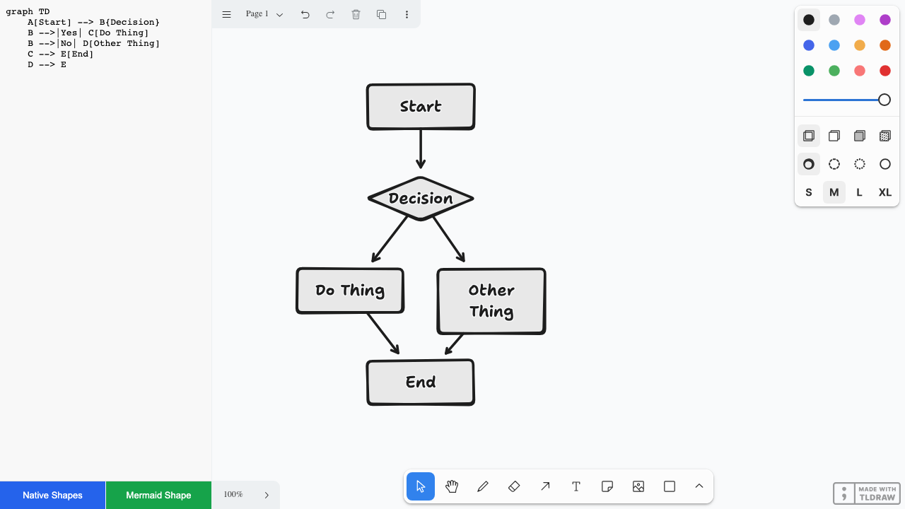

# Mermaid to TLDraw

Convert Mermaid diagrams to TLDraw shapes.



## Features

- **Native Shapes** - Converts Mermaid flowcharts to editable TLDraw shapes (rectangles, diamonds, arrows)
- **Mermaid Shape** - Renders Mermaid diagrams as custom TLDraw shapes using mermaid.js

## Getting Started

```bash
pnpm install
pnpm dev
```

Open http://localhost:5173 in your browser.

## Usage

1. Enter a Mermaid diagram in the text area on the left
2. Click **Native Shapes** to convert to editable TLDraw shapes
3. Or click **Mermaid Shape** to add as a rendered Mermaid diagram

## Project Structure

```
packages/
  mermaid-to-tldraw/   # Core converter library
apps/
  demo/                # Demo application
```
